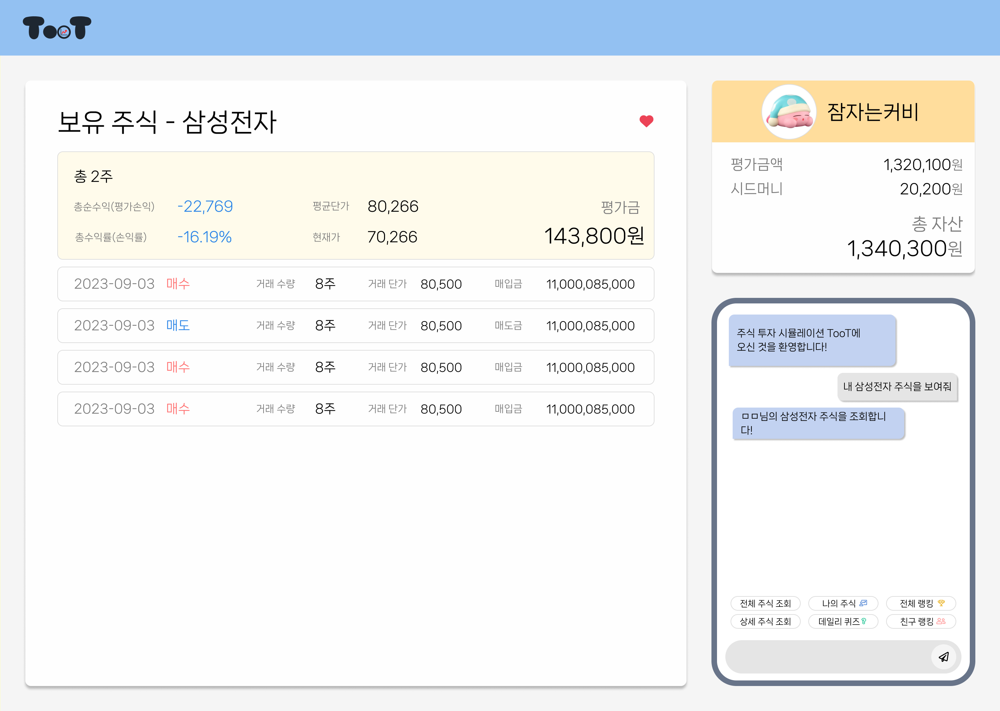

# A709 특화 프로젝트 *TooT*📈

## 💡 기획 배경
- 금융, 주식에 관심이 없는 젊은 연령층 대상 실전 교육을 위해
- 쉽고 재미있게 주식을 배울 수 있도록

## 🚩 대상
- 금융에 대해 어렵게 생각하는 10대, 20대
- 주식 투자를 시작하고 싶지만 어려운 초보자
- 주식 투자에 흥미를 느끼지 못하는 사람

## 🌟 기대 효과
- 주식 초보자에게 재미와 학습을 동시에
- 주식을 더 공부하고 싶게 만들게 하도록
- 제대로 공부하지 않고 주식을 해왔던 사람들로 하여금 더 건강한 투자를 할 수 있게

## 💻 주요 기능
📊 모의 주식 투자  
👾 Naver Clova 챗봇 + ChatGPT   
💯 데일리 퀴즈로 주식 용어 공부  
🥇 친구와 랭킹으로 경쟁  
💸 파산으로 새 기회를 드립니다  

## 🔧 기술 스택

 
   
   
  
  
  
  
  
   

   
  
   
  
   
   
   
  
  
   

  
   
  
  
  
  
  
   

 

| Skill | Version |
|--|--|
|Java|17|
|SpringBoot|3.1.3|
|MySQL|8.0.34|
|Node.js|18.17.1|
|npm|9.6.7|
|TypeScript|4.9.5|
|React|18.2.0|
|React Router|6.15.0|
|React Query|4.3.0|
|React Helmet|6.1.0|
|axios|1.5.0|
|Tailwind CSS|3.3.3|
|apexcharts|3.42.0|
|CI/CD|Jenkins, Docker, Nginx|

## 📆 개발 기간
2023.08.28 ~ 2023.10.06(6주)

## 😎 팀 구성원 및 역할
|                          박우현                          |                          김희조                           |                          서재현                           |                         이예린                         |                            이용현                            |                         한다솜                         |
| :------------------------------------------------------: | :-------------------------------------------------------: | :-------------------------------------------------------: | :----------------------------------------------------: | :----------------------------------------------------------: | :----------------------------------------------------: |
|  |  |  |  |  |  |
|         [WuHyun Park](https://github.com/138901146)          |        [hjkim15](https://github.com/hjkim15)         |        [Eric S.](https://github.com/JamSeo)        |       [예린쓰](https://github.com/h2002y)        |     [KeyPla](https://github.com/LeeeeeYH)      |          [Dasom Han](https://github.com/Amyhds)           |
|                 팀장, 주식 거래, 조회, 계산                |        인증/인가, 퀴즈 API, Redis 연동 API, UCC 제작        |                랭킹, 전체 및 상세 주식 페이지                |       챗봇, 사용자 내역 페이지, express 프록시 서버       |                   Infra, CI/CD, 인증/인가                     |                  KIS API 연동, 파산 기능                 |

## 📑 프로젝트 산출물

와이어프레임

1. 로그인 전 메인 페이지  
  
2. 로그인 후 메인 페이지  
  
3. 전체 주식 조회  
  
4. 상세 주식 조회  
  
5. 주식 매수  
  
6. 주식 매도  
  
7. 사용자 보유 주식 조회  
  
8. 사용자 보유 상세 주식 조회  
  
9. 사용자 거래 내역 조회  
  
10. 전체 랭킹 조회  
  
11. 카카오톡 친구 랭킹 조회  
  
12. 사용자 파산 기록 조회  
  
13. 사용자 파산 기록 상세 조회  
  
14. 데일리 퀴즈 문제  
  
15. 데일리 퀴즈 답  
  

ERD

  

API 명세서

  

아키텍쳐

  

## 🔎 서비스 화면
1. 로그인  
  카카오 OAuth를 이용한 로그인
  
2. 챗봇  
  챗봇을 사용합니다
  
3. 관심 종목  
  관심 종목을 추가합니다.
  
4. 전체 주식  
  전제 주식을 확인합니다.
  
5. 상세 주식  
  상세 주식을 확인합니다.
  
6. 주식 매수, 매도  
  주식을 구매하거나 판매합니다.
  
7. 내 주식 조회  
  내 주식을 조회합니다.
  
8. 내 거래내역  
  내 거래내역을 조회합니다.
  
9. 전체 랭킹  
  전체 사용자의 랭킹을 조회합니다.
  
10. 친구 랭킹  
  내 카카오톡 친구들끼리의 랭킹을 조회합니다.
  
11. 데일리 퀴즈  
  데일리 퀴즈를 진행합니다.
  
12. 파산하기  
  총 자산이 시드머니 대비 70% 아래로 떨어지면, 파산을 할 수 있습니다.
  

## 🎬 UCC
[TooT_UCC](https://www.youtube.com/watch?v=hXRqUKp-7vQ&feature=youtu.be)
